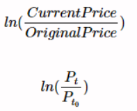
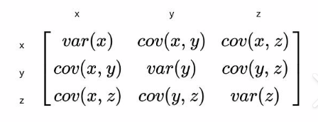
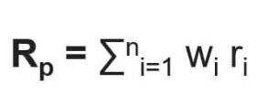
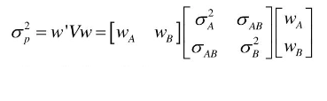
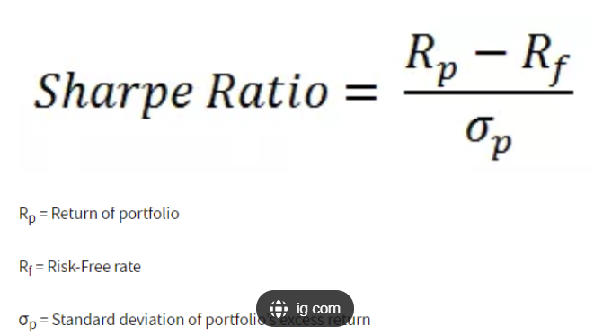
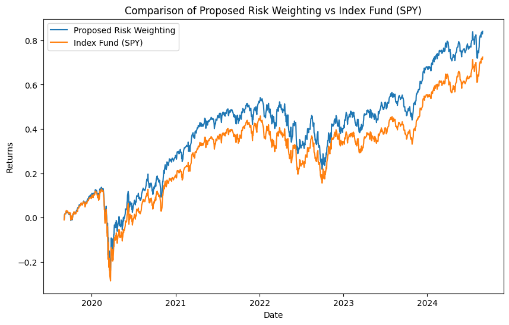

# CAPSTONE Project: Portfolio Optimization Using the Efficient Frontier with Python

# Introduction

Welcome to my CAPSTONE project on **Portfolio Optimization Using the Efficient Frontier with Python**.

Imagine you're an investment consultant, and a client comes to you with a critical question: "If I wanted to invest in a diversified basket of stocks, specifically within the Dow Jones Industrial Average and S&P 500, what would be the optimal stock weightings to achieve the best return or the lowest risk?"

This CAPSTONE project explores the complexities of portfolio management through the lens of such an inquiry. I will demonstrate how to determine the best asset allocation, based on historical performance, using Python and the Efficient Frontier Portfolio theory. By analyzing five years of historical data from these stock indices, I aim to uncover which stocks, and in what proportions, would have historically led to the best possible portfolio in terms of maximizing returns, minimizing risk, or optimizing the Sharpe ratio.

## Defining the Problem

The question guiding this project is: 

**Which stocks from the Dow Jones and S&P 500 should be invested in, and in what weight, to create the most efficient portfolio over the past five years?**

Using the Efficient Frontier method, I explore:
1. The optimal weights that minimize portfolio risk.
2. The optimal weights that maximize expected return.
3. The optimal weights that achieve the best Sharpe ratio (a measure of risk-adjusted return).

This analysis will help simulate how an investment manager might make decisions when balancing risk and return, even though the results are derived from historical data and do not guarantee future performance.

**Note:** This analysis is not investment advice. The method uses a model that fits historical data to estimate the best expected return, and thus it does not guarantee future performance.

However, it offers valuable insights into which stocks have historically outperformed others.

## Tools & Librariess Used

To complete this project, I utilized the following tools and libraries:

- **Python:** The core of my analysis, allowing me to process the data and generate insights. Key libraries used:
    - **Yahoo Finance:** The data is sourced from Yahoo Finance, and Python was used to extract it using the `yahoo_fin` package.
    - **Pandas:** Used for data manipulation and analysis.
    - **Matplotlib:** Employed for visualizing the data.
    - **SciPy:** Used for optimization, similar to Excel Solver, to find the most optimal portfolio given a set of constraints and bounds.
- **Jupyter Notebooks:** Used to run my Python scripts, with easy integration of code, notes, and analysis.
- **Visual Studio Code:** My primary tool for writing and executing Python scripts.
- **Git & GitHub:** Essential for version control and sharing my code, facilitating collaboration and project tracking.

# Data Collection and Preparation

The first step is to gather adjusted closing prices for all stocks in the Dow Jones and S&P 500 over a five-year period. I used the yahoo_fin package for this, extracting daily price data and preparing it for analysis.

Let's start by importing the data, and viewing the structure of the data. Feel free to access my notebook with detailed steps here: [Getting Data](Project\1_Getting_Data.ipynb)

```python
# Get the list of Dow Jones tickers 
dow_tickers = tickers_dow()

# Get a list of S&P 500 tickers
#this should be wroking but it is not so we have to perform an altrnative method
#sp500_tickers = si.tickers_sp500()

import yfinance as yf
# Get the list of S&P 500 tickers
sp500_tickers = pd.read_html('https://en.wikipedia.org/wiki/List_of_S%26P_500_companies')[0]['Symbol'].tolist()

#place the tickers in a dictionary
dow_historical_datas = {}

for ticker in dow_tickers: 
    dow_historical_datas[ticker] = get_data(ticker, start_date="08/30/2019", end_date="08/30/2024", index_as_date = True, interval="1d")['adjclose']

sp500_historical_datas = {}

#some of the ticker was delisted, so i have to use a try catch to continue after an error
for ticker in sp500_tickers: 
    try:
        # Try fetching the historical data for the ticker
        sp500_historical_datas[ticker] = get_data(ticker, start_date="08/30/2019", end_date="08/30/2024", index_as_date=True, interval="1d")['adjclose']
    except AssertionError as e:
        # If an error occurs, print the ticker and skip it
        print(f"Data for {ticker} not found: {e}")
        continue
    except KeyError as e: 
        # If an error occurs, print the ticker and skip it
        print(f"Data for {ticker} not found: {e}")
        continue
```

Once the data was collected, I stored it as CSV files for further analysis. A sample of the data is structured like this:


| Date       | AAPL      | AMGN      | AMZN      | AXP       | 
|------------|-----------|-----------|-----------|-----------|
| 2019-08-30 | 50.496521 | 179.322464| 88.814499 | 112.236336|
| 2019-09-03 | 49.761093 | 176.657791| 89.491997 | 109.653526|
| 2019-09-04 | 50.605362 | 177.345474| 90.030998 | 110.399460|
| 2019-09-05 | 51.594780 | 178.488663| 92.036003 | 112.516060|

## Understanding the Data

1. **Data Span**: 5 years of data with 1-day intervals.
2. **Date Range**: From 08/30/2019 to 08/29/2024.
3. **Price Type**: Adjusted closing prices were used as they reflect closing prices more accurately.
4. **Ticker Inclusion**: All tickers in the Dow Average are included in the S&P 500; however, the efficient frontier analysis is performed separately on the Dow Average.
5. **Note**: This analysis is not investment advice. The method uses a model that fits historical data to estimate the best expected return, and thus it does not guarantee future performance.


## Exploring the Efficient Frontier
The Efficient Frontier is a key concept in Modern Portfolio Theory (MPT). It visualizes the trade-off between risk (standard deviation of returns) and reward (expected return). The goal of this analysis is to explore this trade-off using the following key optimization objectives:

- Minimizing Portfolio Variance: This is the "safest" portfolio with the least amount of risk.
- Maximizing Expected Return: This approach seeks to maximize profits but may involve taking on higher risk.
- Maximizing Sharpe Ratio: This optimization finds the best balance between risk and return.

Before diving into the optimization, I calculated the following metrics for each stock:

- Return: The average return over the time period.
- Risk: The volatility or standard deviation of returns.
- Covariance Matrix: This represents how stocks move together and forms the basis of portfolio variance calculations.

[Portfolio variance data for Dow](Project\2_Dow_Data_Cleaning.ipynb)

[Portfolio variance data for SP500](Project\2_SP500_Data_Cleaning.ipynb)


## Return and Risk table (Dow Average)

| Tickers | Return   | Risk     |
|---------|----------|----------|
| AAPL    | 0.001206 | 0.019944 |
| AMGN    | 0.000488 | 0.016084 |
| AMZN    | 0.000527 | 0.022303 |
| AXP     | 0.000668 | 0.023798 |
| BA      | -0.000586| 0.032121 |
| ... 

- Only five stocks are shown here
- The Return is based on on the price change equation below:


- While the risk is just standard deviation of the price change. 

## Covariance Matrix

| Tickers | AAPL      | AMGN      | AMZN      | AXP       | BA        |
|---------|-----------|-----------|-----------|-----------|-----------|
| AAPL    | 0.000398  | 0.000129  | 0.000267  | 0.000217  | 0.000267  |
| AMGN    | 0.000129  | 0.000259  | 0.000095  | 0.000122  | 0.000105  |
| AMZN    | 0.000267  | 0.000095  | 0.000498  | 0.000169  | 0.000205  |
| AXP     | 0.000217  | 0.000122  | 0.000169  | 0.000567  | 0.000487  |
| BA      | 0.000267  | 0.000105  | 0.000205  | 0.000487  | 0.001033  |
| ...    

Based on the covariance matrix equation



## Equations
The equations for portfolio variance, expected return, and the Sharpe ratio are fundamental components of the Efficient Frontier methodology and are defined as follows:






```python
# Define the objective function to minimize (portfolio variance)
# Based on an equation
def portfolio_variance(weights, cov_matrix):
    return np.dot(weights.T, np.dot(cov_matrix, weights))

#get the value of the covariance matrix
cov_matrix = df_cov.values

# Define the Sharpe ratio
def sharpe_r(weights, expected_returns, daily_rf_rate):
    # Calculate the portfolio's expected return
    port_e_r = np.sum(weights * expected_returns)
    # Calculate the portfolio's variance
    port_variance = portfolio_variance(weights, cov_matrix)
    # Calculate the portfolio's standard deviation (risk)
    port_std_dev = np.sqrt(port_variance)
    # Calculate the Sharpe ratio
    return (port_e_r - daily_rf_rate) / port_std_dev

# Defined the expected return 
def port_er(x):
    return sum(x * df_return['Return'])
```


# Portfolio Optimization

## Minmizing Risk
To solve for the optimal portfolio weights under each objective, I used SciPy's minimize method with constraints that the weights must sum to 1, and bounds that each weight must be between 0 and 1.

[code here](Project\3_Dow_Efficient_Frontier.ipynb)

```python
### How to run a minimize optimization problem

# Initial guess for the weights (random weights that sum to 1)
# Create as many weights as there are tickers
np.random.seed(42)
initial_weights = np.array([1.00 / len(df_cov)] * len(df_cov))

# Constraints: weights must sum to 1
constraints = ({'type': 'eq', 'fun': lambda weights: np.sum(weights) - 1}) # all weights sum to 1

# Bounds: weights must be between 0 and 1
bounds = [(0, 1) for _ in range(len(initial_weights))]

# Minimize the portfolio variance
# args provide the second portion of the portfolio_variance function
result = minimize(
    portfolio_variance, #the equation that we want to minimize
    initial_weights, #the initial guess
    args=(cov_matrix,) #additional variables data
    , method='SLSQP' 
    , bounds=bounds, constraints=constraints
    , options={'disp': True} #to see the process
    )

# Optimal weights
weights = result.x
```
## Dow Jones Index
### Minimum Risk Metrics


| **Metric**                       | **Value**  |
|-----------------------------------|------------|
| Global Minimum Portfolio Variance | 0.0129     |
| Portfolio Expected Return         | 0.0004     |
| Annualized Return                 | 0.1006     |
| Annualized Risk                   | 0.2044     |
| Sharpe Ratio                      | -0.021     |

### Suggested Weight

<div style="display: flex; align-items: center;">
  <div style="flex: 1;">
    <table>
      <tr>
        <th>Tickers</th>
        <th>Return</th>
        <th>Risk</th>
        <th>Min_risk_weights</th>
      </tr>
      <tr>
        <td>AAPL</td>
        <td>0.001206</td>
        <td>0.019944</td>
        <td>0.033</td>
      </tr>
      <tr>
        <td>AMGN</td>
        <td>0.000488</td>
        <td>0.016084</td>
        <td>0.033</td>
      </tr>
      <tr>
        <td>AMZN</td>
        <td>0.000527</td>
        <td>0.022303</td>
        <td>0.033</td>
      </tr>
      <tr>
        <td>AXP</td>
        <td>0.000668</td>
        <td>0.023798</td>
        <td>0.033</td>
      </tr>
      <tr>
        <td>BA</td>
        <td>-0.000586</td>
        <td>0.032121</td>
        <td>0.033</td>
      </tr>
      <tr>
        <td>CAT</td>
        <td>0.000953</td>
        <td>0.020350</td>
        <td>0.033</td>
      </tr>
      <tr>
        <td>CRM</td>
        <td>0.000399</td>
        <td>0.024837</td>
        <td>0.033</td>
      </tr>
      <tr>
        <td>...</td>
        <td>...</td>
        <td>...</td>
        <td>...</td>
      </tr>
    </table>
  </div>
  <div style="flex: 1;">
    
  </div>
</div>


## S&P500 Index
### Minimum Risk Metrics

| **Metric**                       | **Value**  |
|-----------------------------------|------------|
| Global Minimum Portfolio Variance | 0.0086     |
| Portfolio Expected Return         | 0.0004     |
| Annualized Return                 | 0.1172     |
| Annualized Risk                   | 0.1369     |
| Sharpe Ratio                      | -0.025     |


### Suggested Weight
<div style="display: flex; align-items: center;">
  <div style="flex: 1;">
    <table>
      <tr>
        <th>Tickers</th>
        <th>Return</th>
        <th>Risk</th>
        <th>Min_risk_weights</th>
      </tr>
      <tr>
        <td>MMM</td>
        <td>0.000150</td>
        <td>0.018460</td>
        <td>0.001</td>
      </tr>
      <tr>
        <td>AOS</td>
        <td>0.000524</td>
        <td>0.018989</td>
        <td>0.001</td>
      </tr>
      <tr>
        <td>ABT</td>
        <td>0.000291</td>
        <td>0.016467</td>
        <td>0.002</td>
      </tr>
      <tr>
        <td>ABBV</td>
        <td>0.001042</td>
        <td>0.015228</td>
        <td>0.012</td>
      </tr>
      <tr>
        <td>ABNB</td>
        <td>-0.000231</td>
        <td>0.031632</td>
        <td>0.007</td>
      </tr>
      <tr>
        <td>...</td>
        <td>...</td>
        <td>...</td>
        <td>...</td>
      </tr>
    </table>
  </div>
  <div style="flex: 1;">
    
  </div>
</div>


## Insights
The optimization problem is designed with constraints and bounds: 
- All portfolio weights must sum to 1
- And, each individual weight must be between 0 

**Equally-Weighted Portfolio Suggestion**

Interestingly, the optimization has proposed an equally-weighted portfolio. Several factors could explain this outcome:

1. Covariance Matrix Influence: The covariance matrix, which measures how the returns of assets move together, may indicate that the assets are similarly correlated. This could lead the optimizer to assign equal weights to balance risk across the assets.

2. Initial Guess Impact: The initial guess for the optimization was an equal-weight portfolio (i.e., 1.00 divided by the number of assets). The optimizer may have found this close to the optimal solution, further justifying the equal weights.

3. Low Return Variability: If the returns across assets show low variability, the optimizer might not identify a strong reason to favor one asset over another, resulting in similar weights for each asset.

**Minimum Risk Portfolio Comparison**
| Metric                            | Dow Jones Index   | S&P 500 Index    |
|------------------------------------|-------------------|------------------|
| Global Minimum Portfolio Variance  | 20.44% (annualized) | 13.69% (annualized) |
| Portfolio Expected Return          | 10.06% (annualized) | 11.72% (annualized) |
| Sharpe Ratio                       | -0.021            | -0.025           |


For the Dow Jones index, the global minimum variance portfolio produced a higher annualized risk (20.44%) and slightly lower annualized return (10.06%) compared to the S&P 500 (13.69% risk, 11.72% return). 

Both portfolios have negative Sharpe ratios (-0.021 for Dow Jones and -0.025 for S&P 500), indicating that risk-adjusted returns are marginally negative and may not be compensating well for the level of risk taken, relative to a risk-free asset.

When comparing both portfolios, the S&P 500 index appears to offer a lower risk level (13.69% vs. 20.44% for Dow Jones) with a slightly higher expected return (11.72% vs. 10.06%). This could reflect the broader and more **diversified nature of the S&P 500 index relative to the Dow Jones.**


**Note:** Achieving this minimum risk required assigning each ticker an equal weight, based on the optimizer's output. However, this is not financial advice. The analysis is based on five years of historical data, and past performance does not guarantee future results.


## Maximizing Expected Return


[code here](Project\3_Dow_Efficient_Frontier.ipynb)

For investors seeking maximum return, we find that an aggressive portfolio with higher risk would have performed best historically. The results:


``` python 
# Assuming df_return has columns 'risk' and 'return'
# Initial guess for the weights (random weights that sum to 1)
np.random.seed(42)
np.random.seed(42)
initial_weights = np.array([1.00 / len(df_cov)] * len(df_cov))
#defined the reverse of it, to use minimize 
def neg_port_er(x):
    return -port_er(x)

# Constraints: weights must sum to 1
constraints = ({'type': 'eq', 'fun': lambda weights: np.sum(weights) - 1})

# Bounds: weights must be between 0 and 1
#using the range function to create a list of 27 bounds
bounds = [(0, 1) for _ in range(len(initial_weights))]

# Minimize the portfolio variance
result = minimize(neg_port_er, initial_weights, method='SLSQP', bounds=bounds, constraints=constraints)

# Optimal weights
weights = result.x
```
### Maximum Return Metrics


| **Metric**                       | **Value**  |
|-----------------------------------|------------|
| Max Return Portfolio Variance | 0.0151     |
| Portfolio Expected Return         | 0.0009     |
| Annualized Return                 | 0.2668     |
| Annualized Risk                   | 0.2393     |
| Sharpe Ratio                      | 0.019      |

### Suggested Weight

<div style="display: flex; align-items: center;">
  <div style="flex: 1;">
    <table>
      <tr>
        <th>Tickers</th>
        <th>Return</th>
        <th>Risk</th>
        <th>Max_return_weights</th>
      </tr>
      <tr>
        <td>AAPL</td>
        <td>0.001206</td>
        <td>0.019944</td>
        <td>0.280</td>
      </tr>
      <tr>
        <td>AXP</td>
        <td>0.000668</td>
        <td>0.023798</td>
        <td>0.057</td>
      </tr>
      <tr>
        <td>CAT</td>
        <td>0.000953</td>
        <td>0.020350</td>
        <td>0.175</td>
      </tr>
      <tr>
        <td>GS</td>
        <td>0.000823</td>
        <td>0.020402</td>
        <td>0.122</td>
      </tr>
      <tr>
        <td>JPM</td>
        <td>0.000677</td>
        <td>0.020066</td>
        <td>0.061</td>
      </tr>
      <tr>
        <td>MSFT</td>
        <td>0.000910</td>
        <td>0.019080</td>
        <td>0.158</td>
      </tr>
      <tr>
        <td>UNH</td>
        <td>0.000798</td>
        <td>0.018542</td>
        <td>0.111</td>
      </tr>
      <tr>
        <td>WMT</td>
        <td>0.000616</td>
        <td>0.014033</td>
        <td>0.036</td>
      </tr>
    </table>
  </div>
  <div style="flex: 1;">
    
  </div>
</div>

## S&P500 Index
### Maximum Return Metrics

| **Metric**                       | **Value**  |
|-----------------------------------|------------|
| Global Minimum Portfolio Variance | 0.0258     |
| Portfolio Expected Return         | 0.0026     |
| Annualized Return                 | 0.9172     |
| Annualized Risk                   | 0.4094     |
| Sharpe Ratio                      | 0.075      |


### Suggested Weight

<div style="display: flex; align-items: center;">
  <div style="flex: 1;">
    <table>
      <tr>
        <th>Tickers</th>
        <th>Return</th>
        <th>Risk</th>
        <th>Min_risk_weights</th>
      </tr>
      <tr>
        <td>AAPL</td>
        <td>0.001206</td>
        <td>0.019944</td>
        <td>0.033</td>
      </tr>
      <tr>
        <td>AMGN</td>
        <td>0.000488</td>
        <td>0.016084</td>
        <td>0.033</td>
      </tr>
      <tr>
        <td>AMZN</td>
        <td>0.000527</td>
        <td>0.022303</td>
        <td>0.033</td>
      </tr>
      <tr>
        <td>AXP</td>
        <td>0.000668</td>
        <td>0.023798</td>
        <td>0.033</td>
      </tr>
      <tr>
        <td>BA</td>
        <td>-0.000586</td>
        <td>0.032121</td>
        <td>0.033</td>
      </tr>
      <tr>
        <td>CAT</td>
        <td>0.000953</td>
        <td>0.020350</td>
        <td>0.033</td>
      </tr>
      <tr>
        <td>CRM</td>
        <td>0.000399</td>
        <td>0.024837</td>
        <td>0.033</td>
      </tr>
      <tr>
        <td>CEG</td>
        <td>0.002379</td>
        <td>0.025558</td>
        <td>0.168</td>
      </tr>
      <tr>
        <td>GEV</td>
        <td>0.002844</td>
        <td>0.032370</td>
        <td>0.291</td>
      </tr>
      <tr>
        <td>NVDA</td>
        <td>0.002660</td>
        <td>0.033361</td>
        <td>0.243</td>
      </tr>
      <tr>
        <td>SMCI</td>
        <td>0.002523</td>
        <td>0.042461</td>
        <td>0.207</td>
      </tr>
      <tr>
        <td>TSLA</td>
        <td>0.002085</td>
        <td>0.041309</td>
        <td>0.091</td>
      </tr>
    </table>
  </div>
  <div style="flex: 1;">
    
  </div>
</div>


## Insights

Here’s a more concise version, comparing the maximum return portfolios while aligning it with the minimum risk insights:

---

### Maximum Return Portfolio Comparison

| Metric                            | Dow Jones Index   | S&P 500 Index    |
|------------------------------------|-------------------|------------------|
| Max Return Portfolio Variance      | 15.1% (annualized) | 25.8% (annualized) |
| Portfolio Expected Return          | 26.68% (annualized) | 91.72% (annualized) |
| Sharpe Ratio                       | 0.019             | 0.075            |

#### Insights
Compared to the minimum risk portfolios, the maximum return portfolios target aggressive growth:

1. **Higher Risk and Return**: The S&P 500 portfolio is significantly riskier, with **higher variance (25.8%)** and **higher expected return (91.72%)** than Dow Jones, making it more suitable for risk-tolerant investors. Both portfolios show positive Sharpe ratios (0.019 for Dow Jones, 0.075 for S&P 500), indicating better risk-adjusted returns than their minimum risk counterparts.

2. **Sector Influence**: The Dow Jones portfolio maintains balanced exposure across tech (AAPL, MSFT) and defensive sectors (WMT), offering a diversified, moderate-risk strategy. The S&P 500, however, concentrates on high-growth tech (NVDA, TSLA), explaining its elevated risk and return.

3. **Return vs. Risk Trade-off**: While S&P 500 delivers superior returns, Dow Jones offers a more stable option with lower variance, appealing to more conservative investors.

**Note:** To achieve this maximum return, we must assign each ticker an equal weight based on the optimization output. This is not financial advice; the data is based on 5 years of historical data, and past performance does not guarantee future results.

# Optimizing the Sharpe Ratio

Finally, the investor might be more interested in optimizing for the Sharpe Ratio, which measures return per unit of risk. The results:

```python
# Initial guess for the weights (random weights that sum to 1)
np.random.seed(42)
initial_weights = np.array([1.00 / len(df_cov)] * len(df_cov))
# Define the negative Sharpe ratio to use with minimize
def neg_sharpe_r(weights, expected_returns, daily_rf_rate):
    return -sharpe_r(weights, expected_returns, daily_rf_rate)

# Constraints: weights must sum to 1
constraints = ({'type': 'eq', 'fun': lambda weights: np.sum(weights) - 1})

# Bounds: weights must be between 0 and 1
bounds = [(0, 1) for _ in range(len(initial_weights))]

# Assuming df_return contains the expected returns
expected_returns = df_return['Return'].values

# Minimize the negative Sharpe ratio to maximize the Sharpe ratio
result = minimize(neg_sharpe_r, initial_weights, args=(expected_returns, daily_rf_rate), method='SLSQP', bounds=bounds, constraints=constraints)

# Optimal weights
weights = result.x
```

### Maximum Sharpe Metrics


| **Metric**                       | **Value**  |
|-----------------------------------|------------|
| Max Sharpe Portfolio Variance | 0.0181     |
| Portfolio Expected Return         | 0.0012     |
| Annualized Return                 | 0.3405     |
| Annualized Risk                   | 0.2393     |
| Sharpe Ratio                      | 0.028      |

### Suggested Weight

<div style="display: flex; align-items: center;">
  <div style="flex: 1;">
    <table>
      <tr>
        <th>Tickers</th>
        <th>Return</th>
        <th>Risk</th>
        <th>Max_sharpe_weights</th>
      </tr>
      <tr>
        <td>AAPL</td>
        <td>0.001206</td>
        <td>0.019944</td>
        <td>0.831</td>
      </tr>
      <tr>
        <td>CAT</td>
        <td>0.000953</td>
        <td>0.020350</td>
        <td>0.169</td>
      </tr>
    </table>
  </div>
  <div style="flex: 1;">
    
  </div>
</div>


## S&P500 Index
### Maximum Sharpe Metrics

| **Metric**                       | **Value**  |
|-----------------------------------|------------|
| Global Minimum Portfolio Variance | 0.0130     |
| Portfolio Expected Return         | 0.0019     |
| Annualized Return                 | 0.6132     |
| Annualized Risk                   | 0.4094     |
| Sharpe Ratio                      | 0.096      |


### Suggested Weight
<div style="display: flex; align-items: center;">
  <div style="flex: 1;">
    <table>
      <tr>
        <th>Tickers</th>
        <th>Return</th>
        <th>Risk</th>
        <th>Max_sharpe_weights</th>
      </tr>
      <tr>
        <td>CARR</td>
        <td>0.001643</td>
        <td>0.023947</td>
        <td>0.030</td>
      </tr>
      <tr>
        <td>CEG</td>
        <td>0.002379</td>
        <td>0.025558</td>
        <td>0.200</td>
      </tr>
      <tr>
        <td>GEV</td>
        <td>0.002844</td>
        <td>0.032370</td>
        <td>0.011</td>
      </tr>
      <tr>
        <td>LLY</td>
        <td>0.001742</td>
        <td>0.019877</td>
        <td>0.214</td>
      </tr>
      <tr>
        <td>MCK</td>
        <td>0.001137</td>
        <td>0.018097</td>
        <td>0.058</td>
      </tr>
      <tr>
        <td>NVDA</td>
        <td>0.002660</td>
        <td>0.033361</td>
        <td>0.113</td>
      </tr>
      <tr>
        <td>VLTO</td>
        <td>0.001612</td>
        <td>0.015654</td>
        <td>0.373</td>
      </tr>
    </table>
  </div>
  <div style="flex: 1;">
    
  </div>
</div>

## Insights

### Maximum Sharpe Ratio Portfolio Comparison

| Metric                            | Dow Jones Index    | S&P 500 Index    |
|------------------------------------|-------------------|------------------|
| Max Sharpe Portfolio Variance      | 18.1% (annualized) | 13.0% (annualized) |
| Portfolio Expected Return          | 34.05% (annualized) | 61.32% (annualized) |
| Sharpe Ratio                       | 0.028             | 0.096            |


1. **Heavily Skewed Allocation**:
   - In the Dow Jones portfolio, **AAPL dominates** with an 83.1% allocation, driven by its high return relative to risk. **CAT** balances the remaining 16.9%. This concentrated weighting suggests the optimization favors AAPL due to its strong **risk-return profile**.
   - The S&P 500 portfolio is **more diversified**, with major weights in **VLTO (37.3%)**, **LLY (21.4%)**, and **CEG (20%)**, while tech growth stock **NVDA (11.3%)** plays a significant role as well.

2. **Risk-Adjusted Return Priority**:
   - The **Sharpe ratio** is designed to maximize returns per unit of risk. Both portfolios focus on **risk-adjusted returns**, but the **S&P 500’s higher Sharpe ratio (0.096)** indicates it better compensates for the risks taken than the Dow Jones portfolio (0.028).
   - **AAPL’s** high allocation in the Dow Jones portfolio reflects its superior **return-to-risk balance**, despite the portfolio’s higher overall concentration. Conversely, the S&P 500 portfolio spreads risk across multiple sectors and stocks, providing a broader hedge.

3. **Diverse Sector Allocation**:
   - The **Dow Jones portfolio** is dominated by tech (AAPL) and industrial (CAT), indicating less diversification. The **S&P 500**, however, blends **healthcare (LLY)**, **utilities (CEG)**, and **tech (NVDA)**, achieving greater sector diversity.
   
4. **Return vs. Risk Trade-off**:
   - While **Dow Jones** has a concentrated risk-return profile with **lower Sharpe ratio**, its heavy weighting toward AAPL shows that the portfolio’s potential is tied closely to this single asset. 
   - **S&P 500** offers a more **balanced portfolio**, with **lower variance (13%)** and a better risk-adjusted return, thanks to its diversified holdings, making it preferable for investors seeking a more balanced approach to risk management.


**Note:** Achieving this maximum return requires assigning equal weight to each ticker, as indicated by the optimization output. However, this is not financial advice, and the data is based on 5 years of historical performance, which does not guarantee future results.

# Final Thoughts

As an investment consultant, when a client asks how to achieve optimal stock weightings for maximum return or minimum risk within a diversified portfolio from the Dow Jones Industrial Average and S&P 500, it underscores the challenges inherent in portfolio management.

This capstone project addresses that question by applying the Efficient Frontier theory to explore portfolio optimization. Through analyzing five years of historical data from both indices, I’ve demonstrated methods for determining the ideal asset allocation that balances maximizing returns, minimizing risk, and improving the Sharpe ratio.

While maximizing returns or optimizing the Sharpe ratio is important, other factors like **diversification**, **concentration risk**, and **optimization constraints** must be considered. For instance, a portfolio concentrated in a few high-return stocks, like AAPL in the Dow Jones, may yield substantial returns but also carries increased exposure to individual stock volatility. On the other hand, a well-diversified portfolio, such as in the S&P 500, spreads risk across sectors, reducing potential losses.

It is essential to note that this analysis is based on historical data and offers valuable insights into asset allocation, but past performance does not guarantee future results. The approach used aligns with historical trends, providing a framework for estimating returns, but it is not financial advice.

Ultimately, the findings from this project empower investors to make informed decisions, helping them navigate the complexities of stock selection and portfolio management with a deeper understanding of risk-return dynamics.